# CareMind AI — ER Diagram

The diagram below shows the main relationships in the CareMind AI MySQL schema.

```mermaid
erDiagram
    ROLES ||--o{ USERS : assigns
    USERS ||--|| USER_PROFILES : has
    USERS ||--o| DOCTORS : may_be

    USERS ||--o{ CARE_CIRCLES : owns
    CARE_CIRCLES ||--o{ CARE_CIRCLE_MEMBERS : contains
    USERS ||--o{ CARE_CIRCLE_MEMBERS : joins

    DOCTORS ||--o{ DOCTOR_PATIENT_RELATIONSHIPS : has
    USERS ||--o{ DOCTOR_PATIENT_RELATIONSHIPS : patient

    USERS ||--o{ CONSENTS : grants
    USERS ||--o{ CONSENTS : receives

    USERS ||--o{ HEALTH_METRICS : records
    HEALTH_METRICS ||--o| BLOOD_PRESSURE_RECORDS : details
    HEALTH_METRICS ||--o| HEART_RATE_RECORDS : details
    HEALTH_METRICS ||--o| GLUCOSE_RECORDS : details
    HEALTH_METRICS ||--o| SPO2_RECORDS : details
    HEALTH_METRICS ||--o| TEMPERATURE_RECORDS : details
    HEALTH_METRICS ||--o| WEIGHT_RECORDS : details

    USERS ||--o{ MEDICINES : takes
    DOCTORS ||--o{ MEDICINES : prescribes
    MEDICINES ||--o{ MEDICATION_SCHEDULES : schedules
    MEDICATION_SCHEDULES ||--o{ MEDICATION_LOGS : creates
    USERS ||--o{ MEDICATION_LOGS : confirms

    USERS ||--o{ HEALTH_REPORTS : owns
    USERS ||--o{ HEALTH_REPORTS : uploads
    HEALTH_REPORTS ||--o{ REPORT_RESULTS : contains

    USERS ||--o{ SYMPTOMS : reports
    USERS ||--o{ ACTIVITIES : performs
    USERS ||--o{ SLEEP_RECORDS : records
    USERS ||--o{ MOOD_RECORDS : records
    USERS ||--o{ WATER_RECORDS : records

    USERS ||--o{ POSTS : creates
    CARE_CIRCLES ||--o{ POSTS : scopes
    ACTIVITIES ||--o{ POSTS : may_link
    POSTS ||--o{ POST_COMMENTS : receives
    POSTS ||--o{ POST_REACTIONS : receives
    USERS ||--o{ POST_COMMENTS : writes
    USERS ||--o{ POST_REACTIONS : reacts

    CARE_CIRCLES ||--o{ CONVERSATIONS : supports
    USERS ||--o{ CONVERSATIONS : patient
    CONVERSATIONS ||--o{ CONVERSATION_MEMBERS : contains
    USERS ||--o{ CONVERSATION_MEMBERS : joins
    CONVERSATIONS ||--o{ MESSAGES : contains
    USERS ||--o{ MESSAGES : sends

    USERS ||--o{ APPOINTMENTS : attends
    DOCTORS ||--o{ APPOINTMENTS : provides
    USERS ||--o{ DOCTOR_CARE_PLANS : receives
    DOCTORS ||--o{ DOCTOR_CARE_PLANS : creates

    USERS ||--o{ EMERGENCY_CONTACTS : owns
    USERS ||--o{ EMERGENCY_CONTACTS : may_link
    USERS ||--o{ EMERGENCY_EVENTS : triggers
    EMERGENCY_EVENTS ||--o{ EMERGENCY_LOGS : records
    USERS ||--o{ EMERGENCY_LOGS : targets

    USERS ||--o{ AI_CONVERSATIONS : owns
    AI_CONVERSATIONS ||--o{ AI_MESSAGES : contains
    USERS ||--o{ AI_INSIGHTS : receives
    USERS ||--o{ RISK_SCORES : receives

    USERS ||--o{ NOTIFICATIONS : receives
    USERS ||--o{ AUDIT_LOGS : performs
```

## Design notes

- `users` is the identity table; role determines the primary application experience.
- `care_circles` and `care_circle_members` implement the private family/caregiver network.
- `consents` provides patient-controlled data sharing.
- Health measurements use a parent `health_metrics` record plus metric-specific detail tables.
- Medicine adherence is represented by scheduled events in `medication_logs`.
- Doctor-patient access is explicitly represented by `doctor_patient_relationships`.
- Chat is separated into general conversation types and AI conversations.
- Emergency events and logs are kept separate for traceability.
- `audit_logs` is included for security-sensitive operations.
